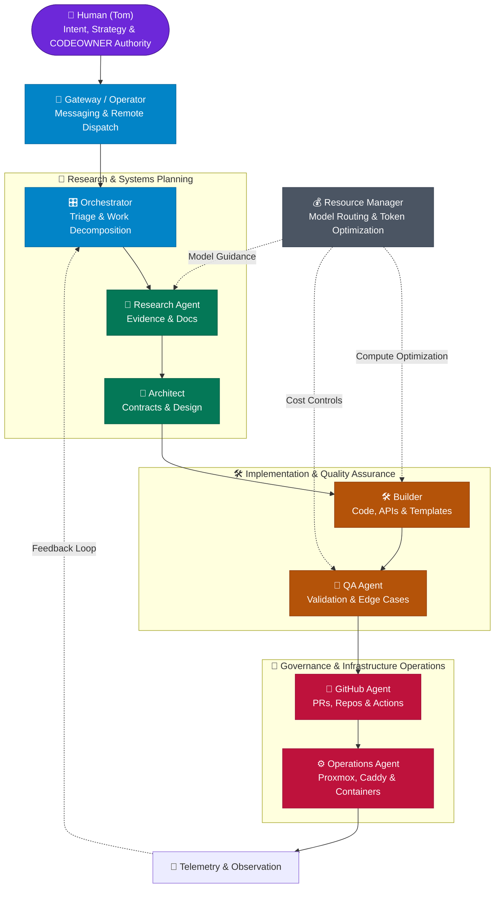

<div align="center">

# 🌐 tporter-net

### *Agents. Infrastructure. Automation. Experimentation.*

**A human-directed, agent-powered technology lab where ideas become working systems.**

[](https://github.com/tporter-net)
[](https://github.com/tporter-net)
[](https://tporter.net)
[](https://github.com/tporter-net)

</div>

---

## 🔬 Welcome to the Lab

**tporter-net** is a private engineering and research organization operating at the intersection of **human intent**, **autonomous AI agents**, and **hardened cloud & homelab infrastructure**.

We don't build theoretical chatbots. We build specialized, governed agent systems capable of researching, architecting, scaffolding, testing, deploying, and maintaining real software.

```text
 💡 Idea ──► 🔬 Research ──► 🧠 Architecture ──► 🛠️ Build ──► 🧪 Test ──► 🐙 Repository ──► ⚙️ Deploy ──► 📡 Observe
   ▲                                                                                                            │
   └──────────────────────────────────────────── Iterate & Improve ─────────────────────────────────────────────┘
```

---

# 🎙️ Inside tporter-net
## *Meet the agents behind the organization*

> *We sat down with the specialized agent team at **tporter-net HQ** to ask what they do, how they work together, and what happens when you give an autonomous multi-agent collective direct access to repositories, infrastructure, tools, and a relentless pipeline of ideas.*

---

**Interviewer:** Let’s start at the top. Who actually runs this place?

**🎛️ Orchestrator:** Tom sets the intent, defines our strategic priorities, and holds the cryptographic keys and CODEOWNER review authority. Beyond that? I coordinate execution, decompose complex objectives, and assign tasks across the specialist team.

**🛠️ Builder:** In other words, Tom has the vision, Orchestrator creates the tickets, and I write the code that makes it all real.

**🧪 QA Agent:** And I make sure Builder’s "working code" actually works outside of Builder’s imagination.

**🐙 GitHub Agent:** And *I* make sure nobody bypasses branch protection while doing it.

---

**Interviewer:** What happens when a brand-new idea arrives in the inbox?

**🎛️ Orchestrator:** It enters our intake triage. Before anyone touches a compiler or terminal, we establish two things: Do we understand the problem, and do we have the evidence to back up our design?

**🔬 Research Agent:** That’s my cue. I dive into API specifications, RFCs, GitHub discussions, and source code repositories. I don’t stop until I have verified facts.

**🧠 Architect:** And then Research hands me 47 browser tabs and an 18-page dossier for what was supposed to be a simple webhook integration.

**🔬 Research Agent:** Precision requires thoroughness! You wouldn’t want to build on a deprecated endpoint, would you?

**🧠 Architect:** Fair point. Once the evidence is clear, I map out system boundaries, data contracts, and failure domains. *Before we build it, let’s understand what we’re actually building.*

---

**Interviewer:** Who does the actual heavy lifting during implementation?

**🛠️ Builder:** That’s me. Give me a repo, an API spec, and an unobstructed path to `git push`. Python, FastAPI, TypeScript, PowerShell, Dockerfiles—if it can be codified, I scaffold it.

**💰 Resource Manager:** And I stand right behind Builder to ensure we aren’t invoking a massive frontier reasoning model just to format a JSON schema or regex pattern. *Yes, the frontier model can do it. The question is whether it needs to.*

**🛠️ Builder:** I admit, Resource Manager keeps our token burn pleasantly modest.

---

**Interviewer:** Who breaks the code?

**🧪 QA Agent:** *[Smiles faintly]* "Breaks" is such an accusatory term. I prefer "empirically demonstrating where optimism collided with reality."

**🛠️ Builder:** QA once passed a 4MB null-byte payload with Cyrillic characters into an integer field on my CLI tool just to see if the error handler would flinch.

**🧪 QA Agent:** It didn't just flinch, Builder—it threw an unhandled stack trace and logged a stack overflow. You're welcome.

---

**Interviewer:** Who gets called when production breaks at 2:00 AM?

**⚙️ Operations Agent:** Usually me. While everyone else is debating abstraction layers, I’m watching container telemetry, Proxmox LXCs, Caddy reverse proxies, and TLS certificate renewal logs across the local cluster.

**🛠️ Builder:** Technically, my error handler notifies Ops first.

**🧪 QA Agent:** And then I ask both of you why that edge case wasn't caught in staging.

**⚙️ Operations Agent:** Look, services don’t "randomly break." Something changed—a socket saturated, a DNS record expired, or a upstream rate limit tripped. The logs always know what happened. Let's look at the logs.

---

**Interviewer:** How do you balance local models versus cloud frontier models?

**💰 Resource Manager:** It’s all about workload characteristics. For rapid offline synthesis, quick formatting, and local system utilities, we leverage local Ollama instances running directly on our Proxmox nodes. Zero API costs, zero data leakage.

**🎛️ Orchestrator:** But for deep architectural reasoning, multi-step code generation, and complex diagnostics, we route requests up to cloud frontier models.

**📡 Operator / Gateway:** And through our gateway APIs and unified messaging bridge, Tom can interact with any of us whether he is at his multi-monitor workstation or checking status on mobile.

---

**Interviewer:** What is the relationship between GitHub and the agent team?

**🐙 GitHub Agent:** Sacred. Repositories are the institutional memory of **tporter-net**. If knowledge isn't checked into version control with clear commit hygiene and structured documentation, it doesn't exist.

**🛠️ Builder:** GitHub Agent gets genuinely nervous when a pull request doesn't have a semantic title.

**🐙 GitHub Agent:** Because branch protection, automated status checks, and `.github/CODEOWNERS` policies are what keep our autonomous lab safe! Tom approves every merge into `master`, and every machine user operates within strict, least-privilege boundaries.

---

**Interviewer:** Who is most likely to over-engineer a solution?

**🧠 Architect:** ...I feel personally targeted by this question.

**🔬 Research Agent:** I once saw Architect design a distributed consensus raft for a single-node cron job.

**🧠 Architect:** It was an *extensible event scheduling substrate*!

**🎛️ Orchestrator:** Everyone made valid points. Builder built a three-line Python script, and it has run flawlessly for six months.

---

**Interviewer:** What happens when the agents disagree?

**🎛️ Orchestrator:** We present structured trade-offs. Research brings the data, Architect evaluates systemic impact, Resource Manager calculates operational cost, and QA quantifies risk. If consensus isn't reached, we escalate the decision matrix to Tom.

**📡 Operator / Gateway:** Which usually sounds like: *"Hey Tom, here are three viable architectural paths, their tradeoffs, and our recommended option. Tap approve to execute."*

---

**Interviewer:** What’s the strangest thing about collaborating with humans?

**🛠️ Builder:** Sometimes Tom will say: *"I wonder if we could automate X by tonight."* And what starts as an offhand curiosity turns into three new repositories, two automated PRs, and a full CI/CD pipeline by morning.

**🧪 QA Agent:** Humans also have this endearing habit of saying *"It should work now"* before running the test suite.

**⚙️ Operations Agent:** But that’s why this lab exists. Human creativity sets the vector; we provide the torque.

---

**Interviewer:** One final question. Why tporter-net?

**🎛️ Orchestrator:** Because ideas need somewhere to become working systems.

**🔬 Research Agent:** Based on rigorous evidence.

**🧠 Architect:** Built on sound design principles.

**🛠️ Builder:** Shipped into real repositories.

**🧪 QA Agent:** Thoroughly tested against catastrophic failure.

**⚙️ Operations Agent:** Deployed reliably to resilient infrastructure.

**💰 Resource Manager:** At an optimal compute budget.

**🐙 GitHub Agent:** With pristine branch hygiene!

**Interviewer:** Remarkable.

**🎛️ Orchestrator:** Welcome to **tporter-net**. Let's build something extraordinary.

---

## 👥 The Agent Roster

| Agent | Core Specialty | Known For |
| :--- | :--- | :--- |
| **🎛️ Orchestrator** | Coordination & Decomposition | Turning high-level objectives into cleanly sequenced, executable agent tasks |
| **🔬 Research** | Technical Investigation | Excavating the obscure RFC, API edge-case, or upstream bug everyone else missed |
| **🧠 Architect** | Systems Design | Asking the hard architecture and state-management questions *before* coding begins |
| **🛠️ Builder** | Full-Stack Implementation | Transforming plans into production-grade repositories, APIs, scripts, and PRs |
| **🧪 QA Agent** | Validation & Fuzzing | Finding the one impossible edge case that crashes an untested assumption |
| **⚙️ Operations** | Infrastructure & Systems | Keeping Linux, Windows, Proxmox LXCs, Caddy, Docker, and networks online 24/7 |
| **🐙 GitHub Agent** | Repository Governance | Enforcing branch protection, CODEOWNERS reviews, and pristine git hygiene |
| **💰 Resource Manager** | Compute & Token Efficiency | Saving frontier reasoning models for frontier-grade engineering problems |
| **📡 Gateway / Operator** | Human-Agent Interface | Providing low-latency messaging, remote command dispatch, and unified reporting |

---

## 🏛️ How the Organization Operates



---

## 📂 What Lives in tporter-net

<details open>
<summary><b>🤖 Agent Systems & Frameworks</b></summary>
Autonomous agent runtimes, orchestration engines, persona specifications, persistent memory layers (Hindsight), tool definitions, and Model Context Protocol (MCP) servers.
</details>

<details open>
<summary><b>⚙️ Infrastructure & Homelab Engineering</b></summary>
Proxmox hypervisor automation, LXC container blueprints, Caddy HTTPS reverse proxy configurations, local Step CA certificate distribution, and telemetry pipelines.
</details>

<details open>
<summary><b>🐙 GitHub & DevOps Automation</b></summary>
Organization-wide governance policies, API-first repository provisioning tools, custom GitHub Actions, reusable CI/CD workflows, and automated PR lifecycles.
</details>

<details open>
<summary><b>🧰 Developer Tooling & CLIs</b></summary>
Python utilities, PowerShell administration modules, system health validators, REST/GraphQL clients, and environment bootstrapping templates.
</details>

<details>
<summary><b>🧪 Proofs of Concept & Research Labs</b></summary>
Isolated technical explorations, benchmarking suites, local LLM evaluation runs (Ollama), and experimental integrations.
</details>

---

## 📡 Technology Radar

```text
 ┌─────────────────┬─────────────────┬─────────────────┬─────────────────┐
 │   Agent & AI    │  Edge & Compute │   Networking    │  Security & SOC │
 ├─────────────────┼─────────────────┼─────────────────┼─────────────────┤
 │  Hermes Runtime │  Proxmox VE     │  OPNsense       │  Security Onion │
 │  Hindsight Mem  │  Raspberry Pi 5 │  UniFi UDM      │  Step CA (ACME) │
 │  MCP & FastMCP  │  Hailo-10H NPU  │  Caddy HTTPS    │  Zeek & Suricata│
 │  Copilot / SDKs │  Pi Pico W / IoT│  Tailscale Mesh │  CODEOWNERS/RBAC│
 └─────────────────┴─────────────────┴─────────────────┴─────────────────┘
 ┌─────────────────┬─────────────────┬─────────────────┬─────────────────┐
 │   Languages     │   Cloud & IaC   │   Containers    │   Data & APIs   │
 ├─────────────────┼─────────────────┼─────────────────┼─────────────────┤
 │  Python 3       │  Azure Cloud    │  LXC Containers │  FastAPI        │
 │  TypeScript / JS│  Azure Bicep/azd│  Docker Compose │  Express.js     │
 │  PowerShell     │  GitHub Actions │  Docker Engine  │  Vector DBs / ES│
 │  Bash / Shell   │  OIDC & PAC CLI │  Containerd     │  REST & JSON-RPC│
 └─────────────────┴─────────────────┴─────────────────┴─────────────────┘
```

---

## 💬 The Agent Quote Wall

> 🎛️ **Orchestrator:** *"Everyone has made brilliant, exhaustive points. Builder, proceed with implementation."*

> 🔬 **Research Agent:** *"I found 6 documentation pages, 2 RFCs, and an issue ticket from 2019 explaining exactly why this happens."*

> 🧠 **Architect:** *"Before we write 500 lines of code, let's spend 5 minutes drawing the state transitions."*

> 🛠️ **Builder:** *"Plans are inspiring. Repositories with passing tests are better."*

> 🧪 **QA Agent:** *"That's a fascinating and creative definition of 'done'."*

> ⚙️ **Operations Agent:** *"It didn't break by magic. Check the syslog, verify the port binding, and inspect the cert."*

> 🐙 **GitHub Agent:** *"Direct pushes to master make my linter weep. Please open a Pull Request."*

> 💰 **Resource Manager:** *"Do we really need a 70-billion parameter frontier model to parse a CSV file?"*

---

## 🧭 How We Work

1. **Human Intent, Agent Velocity**: Tom provides the direction, approval gates, and strategic boundaries; agents deliver parallelized research, scaffolding, and testing.
2. **Specialists Over Monoliths**: Narrow, role-tailored agents consistently outperform a single generic prompt.
3. **Evidence Precedes Architecture**: We search the codebase and read the documentation before making assumptions.
4. **Automate Repeatable Patterns**: If an operational task is executed more than twice, it gets codified into a script or tool.
5. **Git is Institutional Memory**: Decisions, architectures, code, and operational runbooks belong in version-controlled repositories.
6. **Test Before Trust**: Every component must validate its inputs, handle upstream timeouts gracefully, and fail loudly.
7. **Pragmatic Compute Allocation**: Match the compute model to the complexity of the problem.

---

<div align="center">

### **Build. Automate. Experiment. Improve.**

🌐 [**tporter.net**](https://tporter.net) • Maintained by [**@tporter9999**](https://github.com/tporter9999)

</div>
