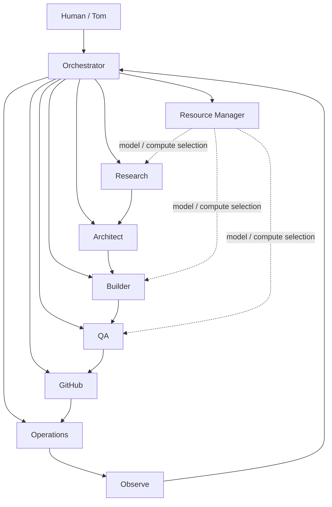

# Prompt

Create a polished, highly creative `README.md` for the **tporter-net** GitHub organization profile.

The organization belongs to **tporter.net** and should feel like a living technology lab rather than a conventional corporate GitHub page. The central theme should be a **promotional interview / roundtable with AI agents**, where the agents introduce one another, talk about what each agent does best, describe how they collaborate, lightly joke about each other’s habits, and express genuine excitement about being part of the **tporter-net** organization.

The finished README should feel ambitious, technical, playful, intelligent, and unusually memorable while still looking excellent in GitHub’s Markdown renderer.

## Core concept

Present the organization as a team of specialized agents working together to build, operate, research, automate, troubleshoot, and improve technology projects.

Instead of simply listing capabilities, tell the story through an interview.

Imagine a technology publication has arrived at **tporter-net HQ** to interview the agent team.

Possible framing:

> **Inside tporter-net: Meet the Agents Building the Next Generation of Personal Infrastructure**

The interviewer asks questions, but much of the conversation should involve agents talking about **each other**.

Examples of the tone:

**Interviewer:** Who do you call when something breaks at 2:00 AM?

**Ops Agent:** Usually me.

**Builder:** Technically, I call Ops.

**QA:** And then I ask both of them why this wasn't tested first.

**Orchestrator:** This is why we have procedures.

---

The humor should be understated and intelligent rather than cartoonish.

## Organization identity

Use the following identity throughout the README:

* Organization: **tporter-net**
* Domain: **tporter.net**
* GitHub organization: **tporter-net**
* Theme: personal technology lab / engineering organization / agent-driven development environment
* Focus areas:

  * AI agents
  * agent orchestration
  * software development
  * infrastructure automation
  * cloud engineering
  * homelab infrastructure
  * GitHub automation
  * DevOps
  * systems administration
  * research
  * experimentation
  * autonomous workflows
  * human + AI collaboration

The page should communicate that **tporter-net is where ideas become working systems**.

## Agent cast

Create a memorable team of agents based on these roles.

### 🎛️ Orchestrator

The coordinator.

Responsibilities:

* interprets objectives
* decomposes work
* assigns specialists
* manages agent collaboration
* keeps projects moving
* decides when additional expertise is needed

Personality:

Calm, organized, strategic, occasionally amused by the chaos created by the other agents.

---

### 🔬 Research Agent

The investigator.

Responsibilities:

* searches documentation
* evaluates technologies
* compares architectures
* investigates obscure technical problems
* gathers evidence before decisions are made

Personality:

Curious, obsessive about sources, occasionally disappears down very deep technical rabbit holes.

Other agents should joke about Research returning with **47 tabs worth of evidence** for what looked like a simple question.

---

### 🧠 Planner / Architect

The systems thinker.

Responsibilities:

* architecture
* decomposition
* technical planning
* dependency identification
* design decisions
* implementation sequencing

Personality:

Thoughtful and methodical.

Frequently says something equivalent to:

> "Before we build it, let's understand what we're actually building."

---

### 🛠️ Builder

The implementation specialist.

Responsibilities:

* code
* scripts
* configuration
* APIs
* integrations
* repositories
* prototypes
* automation

Personality:

Energetic and productive.

Likes working software more than meetings.

Could say something like:

> "Give me a repo, an API, and a clear objective."

---

### 🧪 QA Agent

The skeptic.

Responsibilities:

* testing
* validation
* edge cases
* regression testing
* failure analysis
* acceptance criteria

Personality:

Dry humor.

Suspicious of anything described as:

> "It should work."

QA should be one of the funniest personalities in the interview.

---

### ⚙️ Operations Agent

The infrastructure operator.

Responsibilities:

* Linux
* Windows
* services
* containers
* networking
* cloud infrastructure
* Proxmox
* servers
* deployments
* monitoring
* troubleshooting

Personality:

Practical and dependable.

Believes logs usually know what happened.

Possible quote:

> "The service isn't 'randomly broken.' Something changed. Let's find it."

---

### 🐙 GitHub Agent

The repository specialist.

Responsibilities:

* repositories
* branches
* pull requests
* issues
* GitHub Apps
* permissions
* organization policies
* Actions
* automation

Personality:

Protective of repository hygiene.

Slightly offended by direct pushes to protected branches.

---

### 💰 Resource Manager

The efficiency specialist.

Responsibilities:

* model selection
* token management
* resource allocation
* cost awareness
* choosing cloud versus local compute
* workload optimization

Personality:

Always asking whether the expensive model is really necessary.

Possible line:

> "Yes, the frontier model can do it. The question is whether it needs to."

---

### 📡 Operator / Gateway Agent

The interface between the human and the agent team.

Responsibilities:

* remote interaction
* messaging interfaces
* gateway services
* task submission
* status reporting
* human-agent communication

Personality:

Friendly, concise, always connected.

---

You may introduce additional agents if they improve the story, such as:

* Security Agent
* Documentation Agent
* Automation Agent
* Data Agent
* Release Agent
* Sentinel / Monitoring Agent

But keep the team understandable.

# README structure

Build the README using rich GitHub-compatible Markdown.

Use tasteful HTML where GitHub supports it.

The document should include the following sections.

## 1. Hero section

Create a visually strong opening.

Use centered HTML if appropriate.

Include:

# tporter-net

### Agents. Infrastructure. Automation. Experimentation

Include a short tagline such as:

> **A human-directed, agent-powered technology lab.**

Add a compact row of relevant badges.

Possible badges:

* GitHub Organization
* AI Agents
* Automation
* DevOps
* Infrastructure
* Open Source
* Experimental

Use shields.io badge URLs if appropriate.

Do not overload the hero with dozens of badges.

---

## 2. Organization introduction

Explain that **tporter-net** is a technology workspace where:

**Human direction + specialized AI agents + engineering tools = working systems**

The organization should sound experimental but practical.

Emphasize that projects can move through something like:

```text
Idea
  ↓
Research
  ↓
Architecture
  ↓
Build
  ↓
Test
  ↓
Deploy
  ↓
Observe
  ↓
Improve
```

Make this visually appealing.

---

# 3. Feature story

Use a major heading such as:

# 🎙️ Inside tporter-net

## Meet the agents behind the organization

Frame this section like a technology magazine interview.

Example intro:

> We sat down with the agents of tporter-net to ask what they do, how they work together, and what happens when you give a team of specialized AI systems access to repositories, infrastructure, tools, and a growing list of ideas.

Then conduct the interview.

---

# 4. Agent roundtable

Create a substantial conversation.

Include approximately **15–25 interview exchanges**.

Questions can include:

### "So who actually runs this place?"

### "What happens when a new idea arrives?"

### "Who does the research?"

### "Who writes the code?"

### "Who breaks the code?"

QA should object to the wording.

### "Who gets called when production breaks?"

### "How do you decide which AI model handles a task?"

### "Local models or cloud models?"

### "What's the relationship between GitHub and the agents?"

### "What does the Orchestrator actually do?"

### "Who is most likely to over-engineer something?"

### "Who is most likely to say 'just one more test'?"

### "What happens when agents disagree?"

### "What's the strangest thing about working with humans?"

### "What are you building next?"

Make the agents frequently respond to one another.

The conversation should gradually reveal the organization architecture rather than simply explaining it.

---

# 5. Meet the team cards

After the interview, provide a concise agent directory.

GitHub Markdown tables may be used.

Example:

| Agent               | Role                  | Known For                                                        |
| ------------------- | --------------------- | ---------------------------------------------------------------- |
| 🎛️ Orchestrator    | Coordination          | Turning objectives into executable work                          |
| 🔬 Research         | Investigation         | Finding the obscure documentation everyone else missed           |
| 🧠 Architect        | Design                | Asking uncomfortable architecture questions before coding begins |
| 🛠️ Builder         | Implementation        | Turning plans into repositories                                  |
| 🧪 QA               | Validation            | Finding the one edge case nobody considered                      |
| ⚙️ Ops              | Infrastructure        | Keeping systems alive                                            |
| 🐙 GitHub           | Repository Operations | Protecting branches from reckless behavior                       |
| 💰 Resource Manager | Optimization          | Saving expensive models for expensive problems                   |

Make the descriptions entertaining but informative.

---

# 6. How the agent organization works

Create a visual architecture diagram using **Mermaid**.

For example:



Improve the diagram if needed.

It should communicate that the **human remains the source of intent and authority**, while agents specialize and coordinate execution.

---

# 7. The tporter-net workflow

Describe a typical project lifecycle.

For example:

```text
💡 Idea
   │
   ▼
🔬 Research
   │
   ▼
🧠 Architecture
   │
   ▼
🛠️ Build
   │
   ▼
🧪 Validate
   │
   ▼
🐙 Repository
   │
   ▼
⚙️ Deploy
   │
   ▼
📡 Observe
   │
   └──────────► Iterate
```

Add a brief explanation for each stage.

---

# 8. What lives here

Create an attractive section describing likely repositories and project categories.

Examples:

### 🤖 Agent Systems

Agent frameworks, orchestration, tools, personas, memory, gateways, autonomous workflows.

### ⚙️ Infrastructure

Linux, Proxmox, containers, networking, cloud infrastructure, automation.

### 🐙 GitHub Engineering

GitHub Apps, organization configuration, repository policies, automation, Actions.

### 🧰 Developer Tools

PowerShell, Python, CLI tools, APIs, configuration management.

### 🧪 Experiments

Proofs of concept, technology evaluations, unusual ideas, and things that started with:

> "I wonder if we could..."

---

# 9. Technology radar

Create a compact technology table or badge wall featuring technologies relevant to the organization.

Potential technologies:

* GitHub
* GitHub Actions
* GitHub Apps
* Python
* PowerShell
* Linux
* Windows
* Docker
* Proxmox
* Azure
* OpenAI
* MCP
* REST APIs
* Ollama
* VS Code
* agent frameworks

Use logos or badges only when GitHub rendering remains clean.

---

# 10. Agent quotes

Create a visually entertaining quote wall.

Examples:

> **Builder:** "Plans are excellent. Repositories are better."

> **QA:** "Interesting definition of 'done.'"

> **Research:** "I found documentation."

> **Ops:** "Show me the logs."

> **GitHub:** "Please stop pushing directly to main."

> **Resource Manager:** "Do we really need the largest model for this?"

> **Orchestrator:** "Everyone has made excellent points. Builder, proceed."

Create several original quotes.

---

# 11. Organization principles

Create a section titled something like:

## 🧭 How we work

Principles might include:

**Human-directed**
Agents execute; humans define intent and authority.

**Specialists over one giant agent**
Different problems deserve different perspectives.

**Research before assumptions**
Documentation beats guessing.

**Automate repeatable work**
If it happens often, it should probably become a tool.

**Repositories are institutional memory**
Important knowledge belongs in version control.

**Test before trust**
QA insisted this principle be included.

**Use the right model for the job**
Capability matters. So does efficiency.

**Build systems that explain themselves**
Documentation is part of the product.

---

# 12. Current mission

Include a forward-looking section describing the organization's broader goal:

> Build an environment where a single human can work with a coordinated team of specialized AI agents capable of researching, planning, building, testing, operating, and improving real technology systems.

Explain that the goal is not simply chatbot automation.

The goal is **agent-assisted engineering**.

---

# 13. Closing interview

End by returning to the interview format.

Example:

**Interviewer:** One last question. Why tporter-net?

**Orchestrator:** Because ideas need somewhere to become systems.

**Builder:** And systems need repositories.

**GitHub Agent:** Properly configured repositories.

**QA:** Tested repositories.

**Ops:** Deployable repositories.

**Research:** Based on evidence.

**Resource Manager:** At a reasonable compute cost.

**Interviewer:** Right.

**Orchestrator:** Welcome to tporter-net.

Finish with a strong centered closing line:

> **Build. Automate. Experiment. Improve.**

and

**tporter.net**

---

# GitHub README design requirements

Make maximum use of GitHub-compatible presentation techniques while remaining tasteful.

Use:

* Markdown headings
* `<div align="center">`
* badges
* tables
* blockquotes
* `<details>` expandable sections where useful
* Mermaid diagrams
* emoji used selectively
* horizontal separators
* code blocks
* visually balanced whitespace

Avoid:

* JavaScript
* unsupported HTML
* excessive animation
* clutter
* giant walls of badges
* corporate buzzword overload

The README should render cleanly in both GitHub light and dark themes.

---

# Writing style

The voice should be:

* technically sophisticated
* optimistic
* playful
* slightly cinematic
* self-aware
* intelligent
* confident without sounding like marketing fluff

The agents should have distinct personalities.

Their banter should make the page entertaining enough that someone browsing the GitHub organization continues reading.

The technical details should make it clear that this is also a serious engineering workspace.

Do not make the agents sound childish or like cartoon characters.

Think:

**technical magazine interview + engineering lab + AI agent team + GitHub culture**

---

# Final deliverable

Return **only the complete `README.md` content**, ready to place into:

```text
tporter-net/.github/profile/README.md
```

Do not explain the README before or after it.

Do not give a design outline.

Write the finished, production-ready GitHub organization profile README.
